# Season 2 Week 1

## What has been done this week 

- [x] Go to TrackMan to plan the last part of the project

- [x] Edit report to reflect Johan's comments

- [x] Train a triplet loss model on the wild people dataset

  ```bash
  python embed.py \
      --experiment_root ./experiments/core50_train2 \
      --dataset data/core50_train.csv \
      --filename core50_query_embeddings.h5
  ```

  ```bash
  python embed.py \
      --experiment_root ./experiments/core50_train2 \
      --dataset data/core50_train.csv \
      --filename core50_test_embeddings.h5
  ```

  ```bash
  ./evaluate.py \
      --excluder market1501 \
      --query_dataset data/market1501_query.csv \
      --query_embeddings ./experiments/my_experiment/market1501_query_embeddings.h5 \
      --gallery_dataset data/market1501_test.csv \
      --gallery_embeddings ./experiments/my_experiment/market1501_test_embeddings.h5 \
      --metric euclidean \
      --filename ./experiments/my_experiment/market1501_evaluation.json
  ```

- [x] Use the trained model on the test set and verify the quality of the embedding network

  - [x] Make own scripts for calculating average distance to all query images

  - [x] Compare average distance, top 5 and top 1 accuracy on **wild people dataset**

  - [x] Compare euclidian and cosine distance
    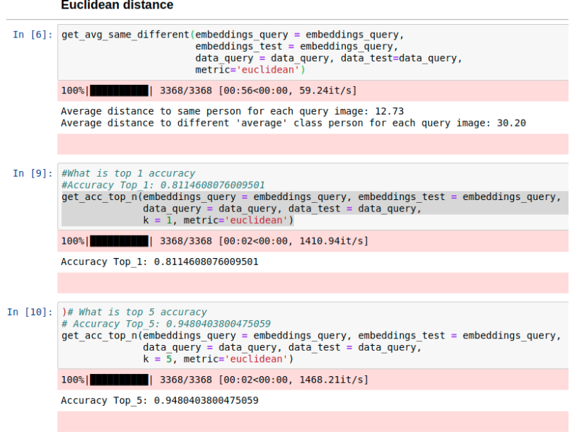

    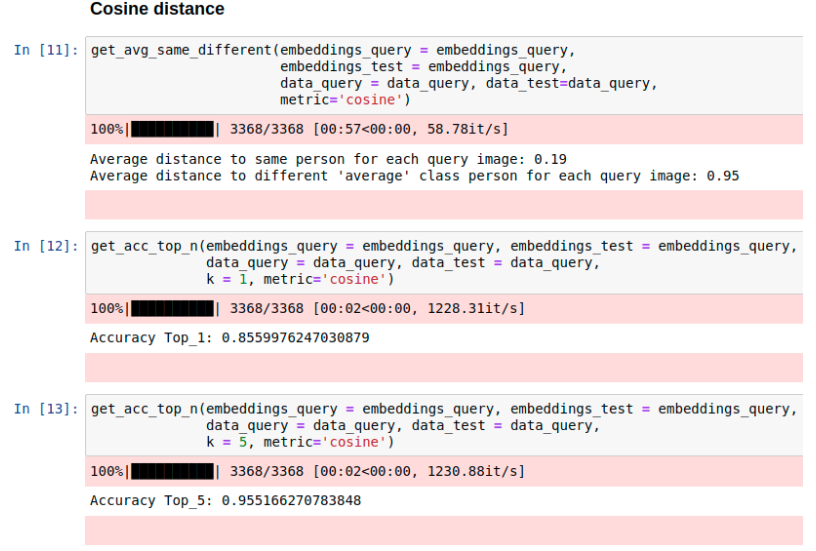

- [x] Wrangle the core50 Dataset to fit the person ReID format

### Core 50

11 scenes in total with the following objects:

```
[o1, ..., o5] -> plug adapters
[o6, ..., o10] -> mobile phones
[o11, ..., o15] -> scissors
[o16, ..., o20] -> light bulbs
[o21, ..., o25] -> cans
[o26, ..., o30] -> glasses
[o31, ..., o35] -> balls
[o36, ..., o40] -> markers
[o41, ..., o45] -> cups
[o46, ..., o50] -> remote controls
```

To analyze the triplet loss method on the core50 dataset, we will do a methodical test of hypothesis increasing in difficulty: 

#### Hypothesis 1: A siamese net will be able to maximize the distance between objects (identities) belonging to the same category on the core50 dataset. (This is a task equivalent of fine-grained classification)

**Test:** We take one category, remote controllers and train a siamese net on 10 environments, holding out 1 environment for for testing.

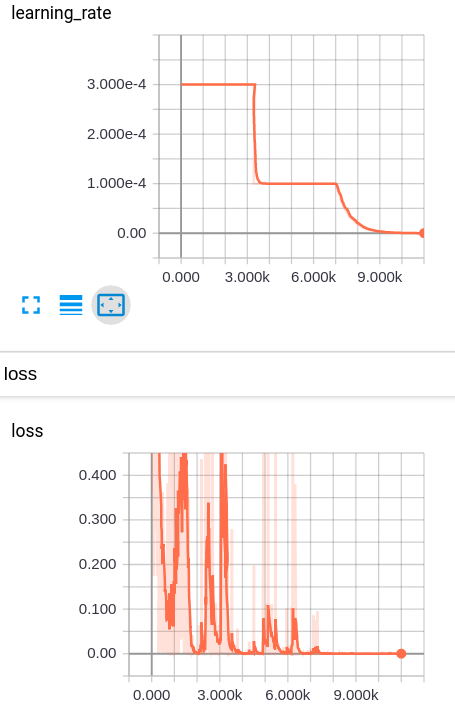

After training, we check the accuracy. Here is is measured by giving an embedding and finding the closest match from the query (training) dataset. The closest match can not be itself: 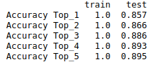

We then visualize the embeddings of the training and test-set.

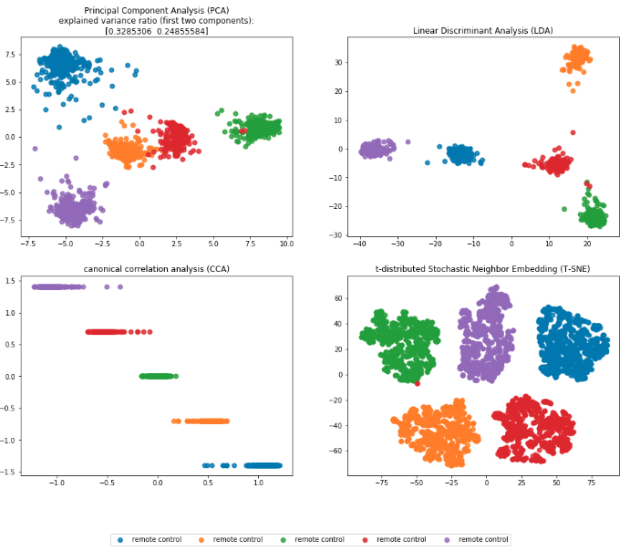

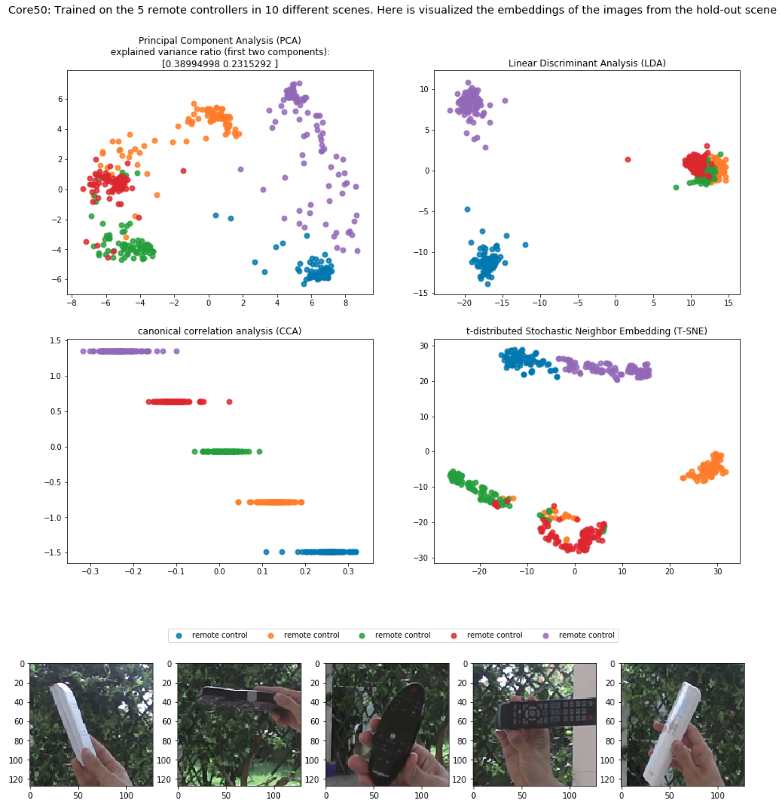


**Conclusion:** some of the remotes look very identical when viewed from some angles, however we see that on the training set we have perfect seperation and on the test-set (an environment never seen before), we also get good results, with an accuracy of 85% in top 1 and 89% in top5, when we use the training set as query. 

#### **Hypothesis 2: A siamese net will be able to correctly re-identify objects it was trained on in an unseen environment on the core50 dataset** 

**Test:** We take 1 objects from each category, giving 10 objects in total. We then use the data from these 10 objects over 10 environments as training data and use the last environment as hold-out test data.

Accuracy: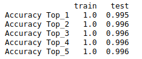

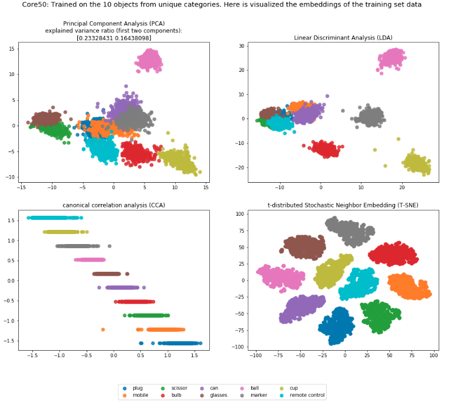

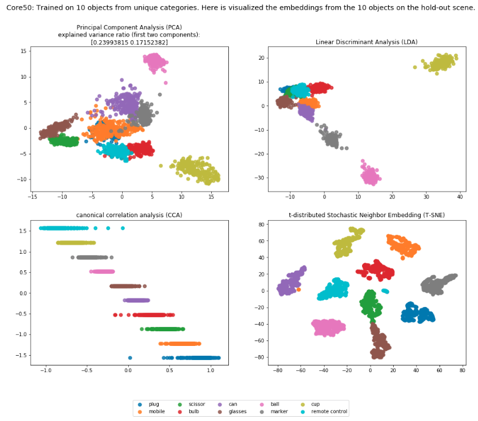

**Conclusion**: We see a nice clustering of the training set, and a high accuracy for the test-set (99%+). The clustering also looks good for the test-set, so the net is able to re-identify objects that it has been trained on. 


#### Hypothesis 3: **A siamese net will be able to cluster never before seen objects from core 50 on a never before seen scene**

**Test:** We hold out 1 object from each class as well as one environment for the test-set. This leaves the net to be trained on 40 objects across 10 environments. 

The object for the test is not in the training set, and since we use the training set as query, we will not calculate accuracy for now. 

Below is shown the T-SNE for the training data:

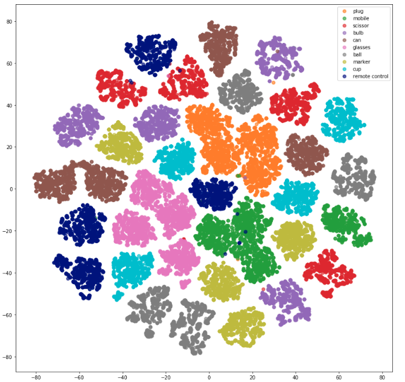

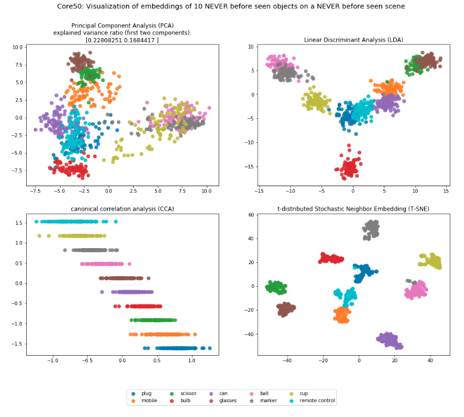

**Conclusion**: The siamese net is able to correctly cluster never before seen objects on a never before seen environment. 

