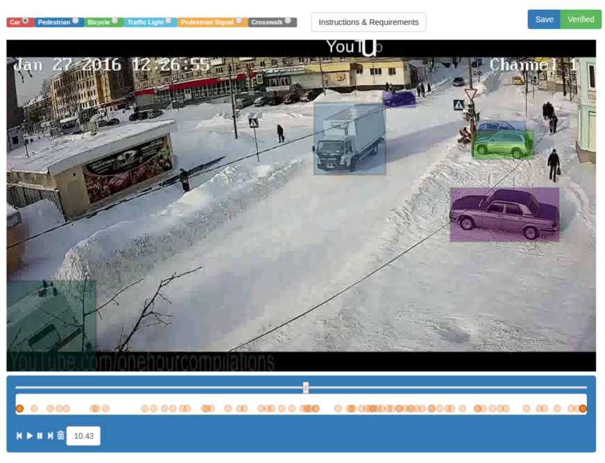

# Week 1 |Under Construction

### What has been done this week

Currently we have 142 videos, with a total duration of 19 mins

More videos are set to come in from the sellers during the next two weeks. I have created scripts for renaming the video files and collecting stats. A script for extracting frames has been made but need to be customized to choose specific part of frames.

- [x] Get set up with the new space
- [x] script for renaming videos
- [x] script to collect stats about videos
- [x] Updated data collection guide and youtube video <https://www.youtube.com/watch?v=1Ltk6quUXYg&vq=hd1080>
- [ ] Script for extracting frames at specific points of the video
- [x] Finish data recording guide and sent out to sellers so that we can collect data.
- [x] Create an annotation tool for annotating events (set of frames) in videos
  
- [x] Setup Citation / References environment (**Zotero**)
- [ ] Annotate bounding box of the frames
- [ ] Figure out which computer to use for DL applications
- [ ] Sign contract
- [ ] Figure out how to group the clubs into classification categories

### Status according to project plan

...

### Literature

* BeaverDam: Video Annotation Tool for Computer Vision Training Labels: https://www2.eecs.berkeley.edu/Pubs/TechRpts/2016/EECS-2016-193.pdf
  * Seems to be best in class for video annotation. Better than VATIC system which was previous best in class. Essentially taking VATIC and removing all the pain points for direct access to MTurk labeling
    
  * Ability to mark an object, let the video play and then move the annotation when the object moves, greatly increasing the number of covered frames as compared to annotating individual frames
  * Push-to-play integration of MTurk

### What to do next week

...

