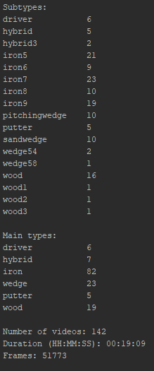
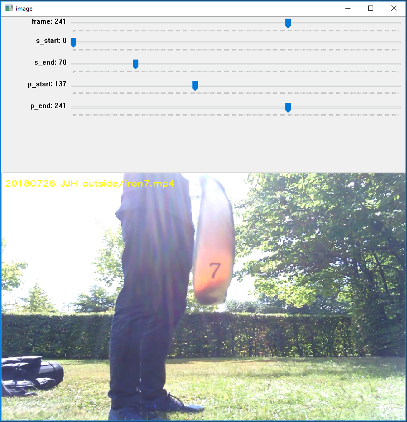
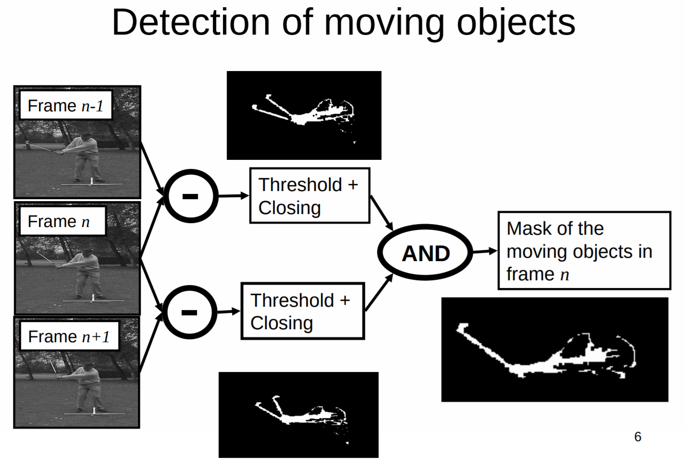
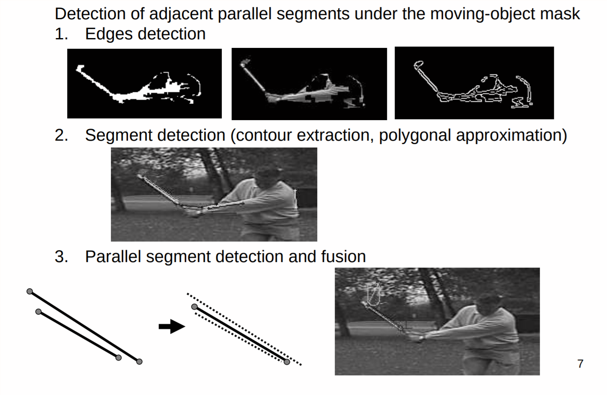
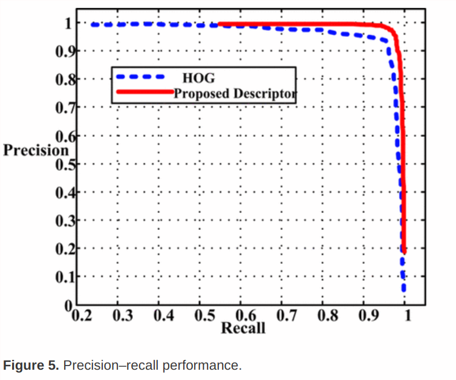
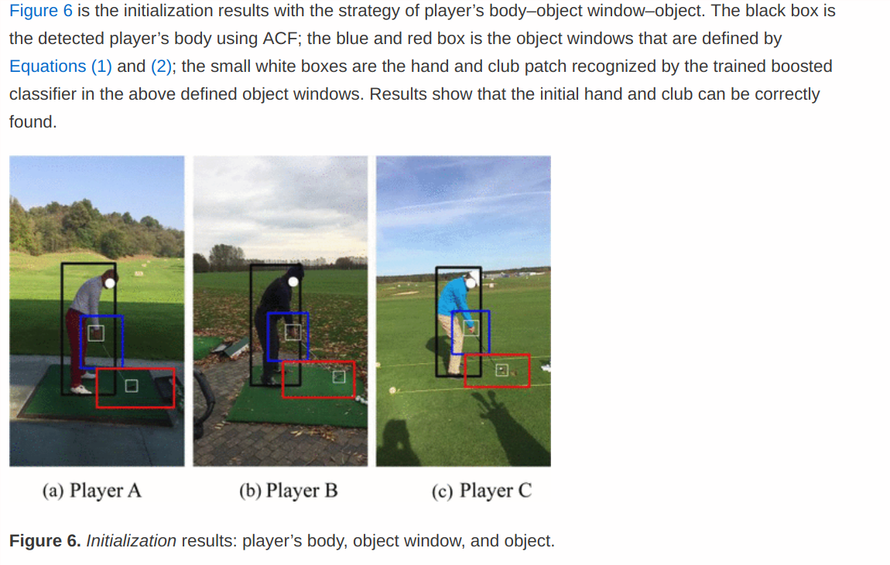

# Week 1

### What has been done this week

Currently we have 142 videos, with a total duration of 19 mins

More videos are set to come in from the sellers during the next two weeks. I have created scripts for renaming the video files and collecting stats. A script for extracting frames has been made but need to be customized to choose specific part of frames.

- [x] Get set up with the new space
- [x] script for renaming videos
- [x] script to collect stats about videos
- [x] Updated data collection guide and youtube video <https://www.youtube.com/watch?v=1Ltk6quUXYg&vq=hd1080>
- [x] Finish data recording guide and sent out to sellers so that we can collect data.
- [x] Create an annotation tool for annotating events (set of frames) in videos
  
- [x] Setup Citation / References environment (**Zotero**)

- [x] Read Trackman Intro Documents
- [x] Setup Microsoft Teams
- [x] Find title for project
  - [x] Golf club detection and identification using deep learning on embedded devices
- [x] Try out BeaverDam annotation software
- [x] Load club data into beaverdam and setup scripts locally

- [x] USB-C Dock and Screens
- [x] literature review

### Status according to project plan

...

### Literature

* BeaverDam: Video Annotation Tool for Computer Vision Training Labels: https://www2.eecs.berkeley.edu/Pubs/TechRpts/2016/EECS-2016-193.pdf
  * Seems to be best in class for video annotation. Better than VATIC system which was previous best in class. Essentially taking VATIC and removing all the pain points for direct access to MTurk labeling
    
  * Ability to mark an object, let the video play and then move the annotation when the object moves, greatly increasing the number of covered frames as compared to annotating individual frames
  * Push-to-play integration of MTurk

* **Visual Golf Club Tracking**, Nicholas Gehrig et. al

  * 
  * 
  * Uses motion estimation (predict where the club will go) and check this with the prev and next frame to remove mis-detections.
  * 
  * Hard to apply to our result because the angle of the camera is very different. 

* **Golf video tracking based on recognition with HOG and spatial–temporal vector**: http://journals.sagepub.com/doi/full/10.1177/1729881417704544, Li Weixian et. al

  * Good performance for a low number of videos. Has a quite different angle than the videos in our project and is more focues on the swing rather than the presentaton of the club.
  * Algorithm:
    1. Body detection (bounding box using Dollar et al)
    2. Get *Rect* for hand and club in initial position from body position (estimated from experience)
    3. Run object detetion in this frame:
       1. Estimate possible postions from last frame
       2. Run Object detection here
       3. Features: [$[HOG_i, HOG_i-HOG_{i-1}, X_i-X_0]$ where $HOG_i$ is the HOG vector in frame *i* and $X_i = [x_i ,y_i]$ is the position coordinates of the object in frame *i*
  * Training is using adaptive boosting algorithm in OpenCV

  * 

  * 

  * 

  * 

  * > Since our golf video database is not large enough, the popular deep learning has not been applied in our framework. In the future, as we get more videos, more work can be done to further improve tracking performance with deep learning when videos are shot in the night, in the overcast day, or in other bad situations.

### What to do next week

Data should be coming in, so need to set up last part of the framework for processing the incomming data. Also have to get a better overview of literature which will partly be done tomorrow (Friday) when I´m not at trackman.

- [ ] Look into docker
- [ ] Annotate bounding box of the frames
- [ ] Figure out which computer to use for DL applications
- [ ] Sign contract
- [ ] Figure out how to group the clubs into classification categories
- [ ] Script for extracting frames at specific points of the video
- [ ] BeaverDam:
  - [ ] Annotation guide
  - [ ] Fix ID's
  - [ ] Deploy on network?
  - [ ] Get bounding box information 

