# Week 11 | Under Construction

## What has been done this week

Mainly been writing report. Messed around with some triplet loss code at some point for the dataset that Anders and Shihav suggested. Need some more modification before it can correctly load the data. 

- [ ] Report

  - [x] MobileNet
  - [x] ResNet 
  - [x] SSD 
  - [x] IOU
  - [x] Golf Club Terminology
  - [x] FaceNet / Triplet Loss
  - [ ] Method
    - [x] Detection
    - [ ] Classification
  - [ ] Conclusion and outlook
  - [ ] Baseball
  - [x] Tesseract
  - [x] Docker

- [x] OpenCV object tracker speed
  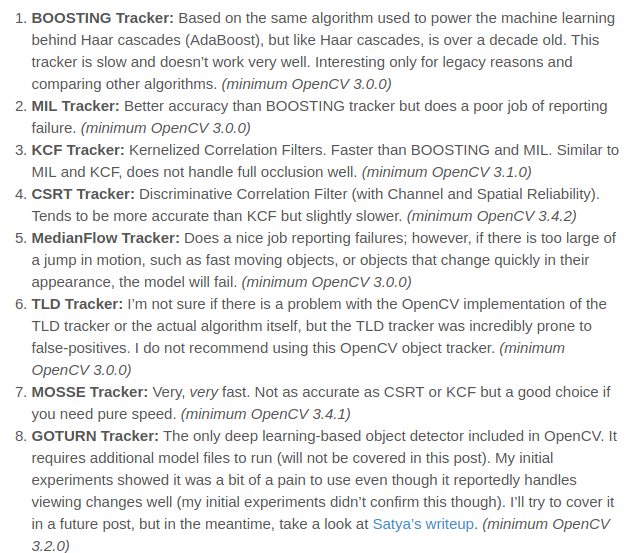
  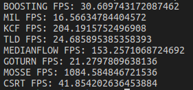
  Tracker performance (by visual performance):

  | Algorithm  | Performance (Visual inspection) | FPS  |
  | ---------- | ------------------------------- | ---- |
  | Boosting   | *Bad*                           | 30.6 |
  | MIL        | OK                              | 16.5 |
  | KCF        | Bad-OK                          | 204  |
  | TLD        | Bad                             | 24.6 |
  | MedianFlow | Bad-Ok                          | 153  |
  | GOTURN     | Bad                             | 21.3 |
  | MOSSE      | Ok                              | 1084 |
  | CSRT       | Good                            | 41.8 |

- [x] Read SSD Paper

- [x] Look at the data from Anders and Shihav
  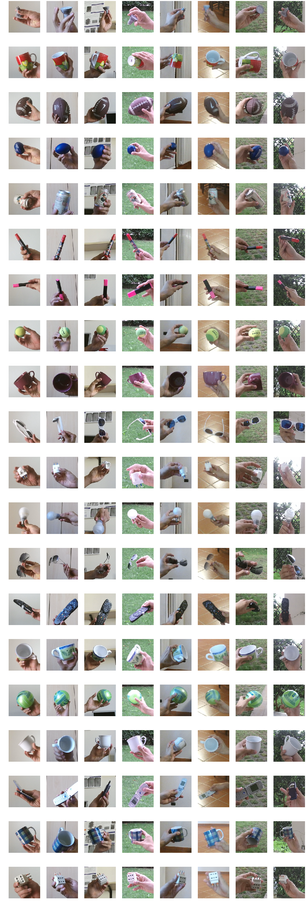

### Golf Terminology

resources: https://www.golf-drives.com/blog/golf-slang/ , https://golfsupport.com/blog/what-are-the-different-types-of-golf-clubs-available/, https://www.livestrong.com/article/139541-list-different-types-golf-clubs-uses/

**Fairway:** The centre, short-mown portion of a golf hole in between the teeing ground and the green.

**Tee:** The area of a golf hole where the ball is first struck.

**Putting Green:** The area of very low cut grass where the hole is located and putting is done.

#### Golf Club Types

**Wood**: Long-distance clubs with a large head and a long shaft used to drive the ball a great distance. A golf set usually has two to three fairway woods and a driver. The fairway woods are, as their names suggest typically used in the fairway, where the irons are out of reach. The driver usually has a loft between 7-11 degrees and the woods has loft between 12-20 degrees to produce higher shots. 

**Iron:** Club with a solid metal head, with a flat angled face and shorter shaft than a wood. Irons are very versatile, but are generally used from the fairway or tee on short holes. Typically numbered from 1 to 9 where the shafts are getting shorter, loft angles higher and club heads heavier as the number increases. 

**Wedge:** A subclass of irons with a greater loft. They usually start at a loft of 47-48 degrees, where the 9 iron usually end at 44-45. They are used for short-distance, high-altitude and high-accuracy shots, usually getting the ball onto the green from tricky position. In golf terms they are typically broken into 4 categories: pitching wedge, gap wedge, sand wedge and lob wedge. For classification, they are usually marked with either their loft, e.g "60" for a 60 degree loft or a letter like "P" for pithing wedge

**Hybrid:** Newest category of club and is a cross between a wood and an iron. Numbered like irons, but doesn't go that high because the number corresponds to the iron that they replace. Most typical hybrids is a 2-hybrid and a 3-hybrid. Used to hit semi-long distance shots, and the design makes it easier to hit shots (like irons), while having the more long-range features of the wood. 

**Putter:** A flat faced club used on or around the green as the last club to get the ball into the hole. They are designed to roll the ball along the green and thus have very little loft (typically 5 degrees). Putters have a large variance in shapes and sizes, since choosing a putter is a quite personal process. 

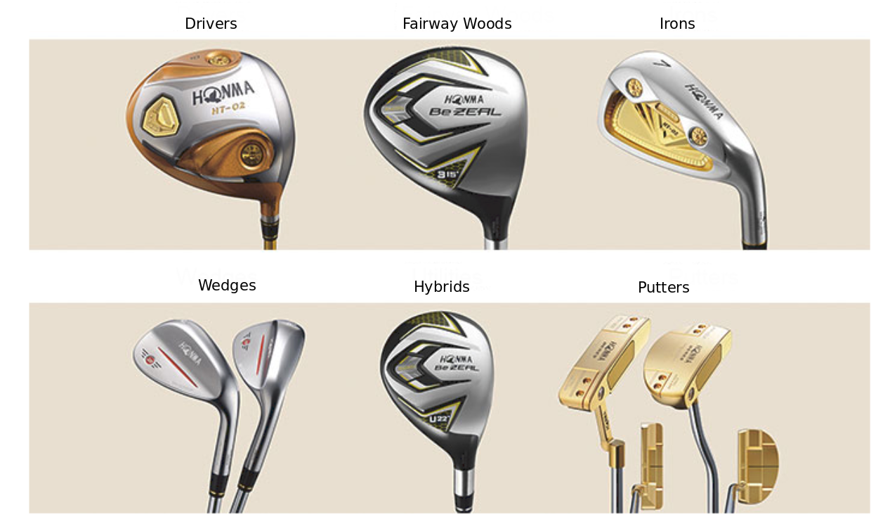

## Literature

### SSD: Single Shot MultiBox Detector https://arxiv.org/pdf/1512.02325.pdf

* Similair to Faster-RCNN in the sense that it also used anchors. 

* To detect objects at multiple scales, it uses feature maps of different sizes. Small feature maps focuses on objects at larger scale. 
  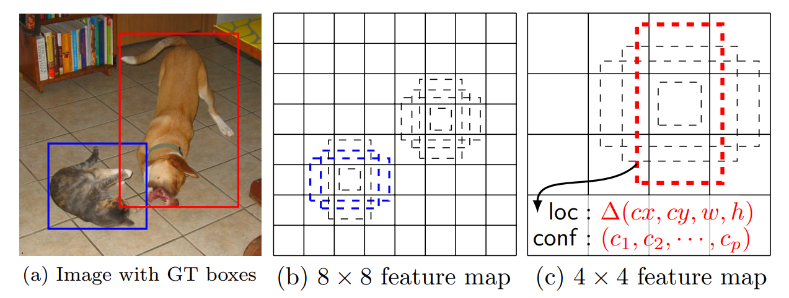
* 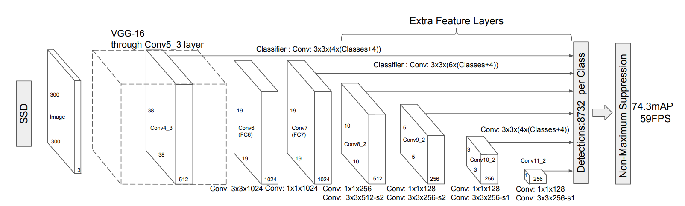
* 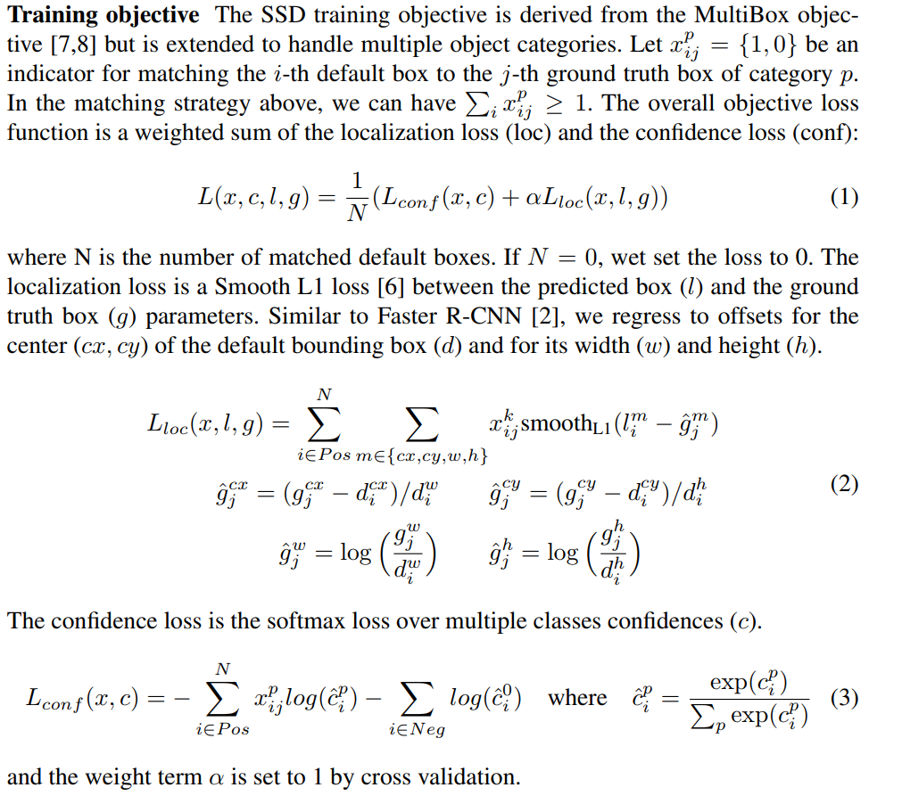
* 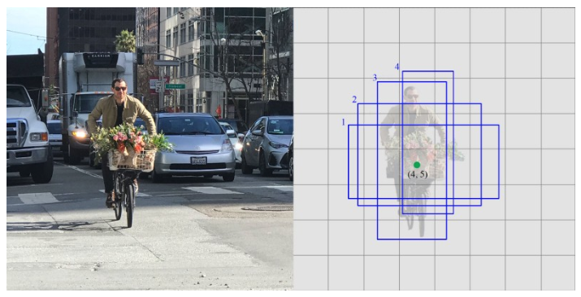
* 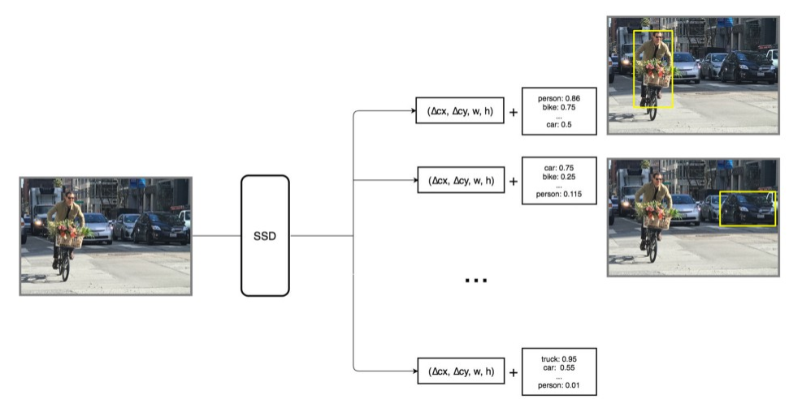
* 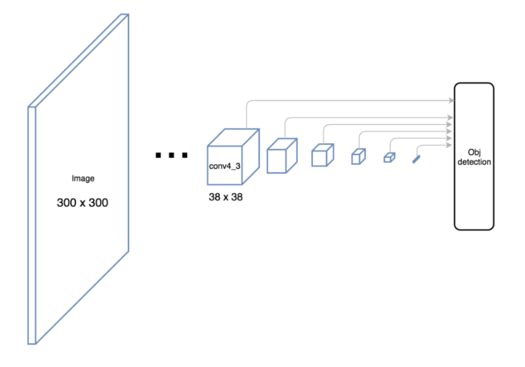
* Matching:
  * For each groundtruth box:
    * Match with prior with highest IOU
  * Foe each prior:
    * IOU_list = IOU(prior, ground_truth_boxes)
    * If max(IOU_list) > threshold
      * Match prior with ground_truth_box argmax(IOU_List)
* Hard negative mining:
  * After the matching step, we will have unmatches_priors >>> matches_priors. --> Very unbalanced dataset --> Sort the unmatched_priors by their confidence loss and mix the hardest unmatches priors with matches priors in a ratio of 3:1

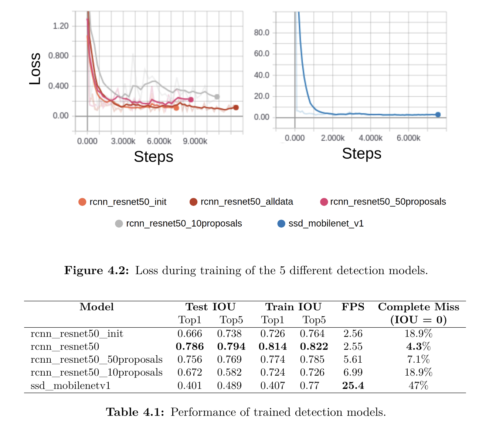

## What to do next week

High burnout at this point -> Will take an extended weekend to recharge. 