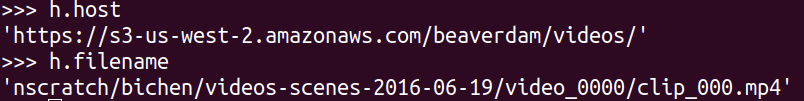

# Week 2

### What has been done this week

I was sick friday, saturday and sunday so not much work was done on these days.

I have been fighting more with beaverdam (annotation tool) this week but it is up and running nicely now and I am done annotation our base dataset of 142 videos. These can now be used to train a basic detection network that can assist in annotating future data.

- [ ] BeaverDam:
  - [ ] Annotation guide
  - [x] Get annotations and put them into files
  - [x] Fix ID's
  - [x] Host videos locally via http using python
  - [x] Deploy on network?
  - [x] Get bounding box information
  - [x] Fix host.id on IP change for the files in the database
  - [x] Make sure that videos are deleted if they are deleted from the data folder
  - [x] Make sure videos are only added if there is not existing a video with that name already in the database
  - [x] Put into /thesis folder to have it in the same version control and easier structure for importing utilities into python etc. 
- [x] Read Old Master Project
- [x] Setup Report
- [x] Upload Picture to Teams
- [x] Ensure renaming script is appropriate (Names does not change when repeatedly running the script)
- [x] Annotate Videos
  

- [x] Program to check annotations
  

### Status according to project plan

This week is set to data annotation / literature study / project plan which is what I have been working on. Data has now been annotated and are ready to be used in a first iteration of a DL pipeline. 

### Literature

#### BeaverDam

**To initiate database:**

`.manage.py flush` | Clear the database

`./manage.py shell < ../thesis/load_data_BeaverDam.py` | Throw in own data

`./manage.py loaddata annotator/fixtures/mydata.yaml` | Put the club class into the database

`./manage.py createsuperuser --name test` | create an annotator

`scripts/serve` | serve the script

`python -m http.server` | host the videos locally

**To put new data in:**

Put the videos in `thesis/vidz` and run `./manage.py shell < ../thesis/load_data_BeaverDam.py`

#### Janus Jensen and Morten Hannemose: "Computer Vision For Golf" 2016:

Project done in coorporation with trackman to detect the impact location between a golf ball and the club using vision and radar. 

Nice method for getting a background image (maybe I can steal it, but I have a person walking around in mine too so it can be hard.)

Method for finding the club. Basically use the PDF from 10!!! annotated images and use a 1-clique MRF to segment foreground and background. Doesn't seem very robust to me. PDF will be widely changing for edge case conditions and I think deep learning will be a more stable approach. 

Super cool figure (not useful for this project though):

### What to do next week

Work on basic detection model, literature search and enhanced project report

- [ ] Find best approach for one class detection network.
- [ ] Setup new computer
- [ ] Look into docker
- [ ] look into pix2pix to generate night training sets: <https://github.com/phillipi/pix2pix>
- [ ] Write introduction to the report.
- [ ] Figure out which computer to use for DL applications
- [ ] Figure out how to group the clubs into classification categories
- [ ] Script for extracting frames at specific points of the video