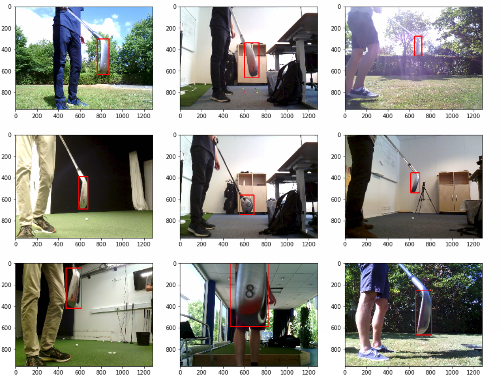
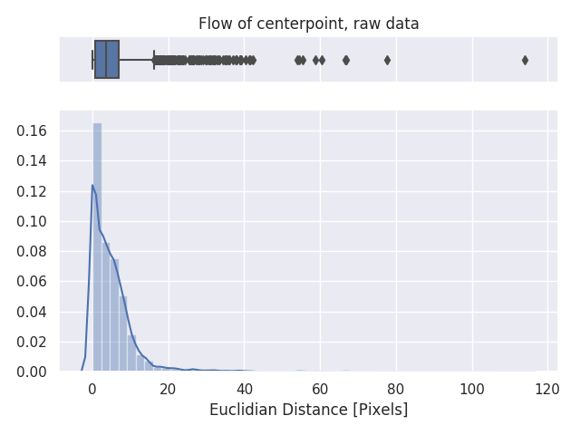
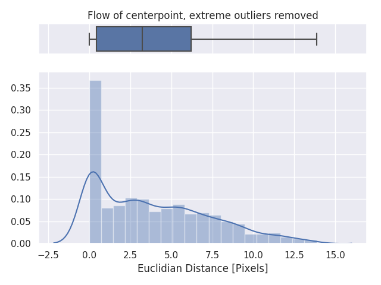
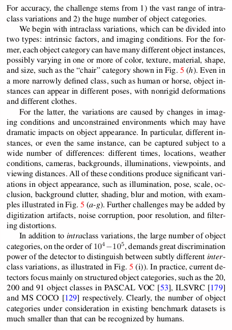
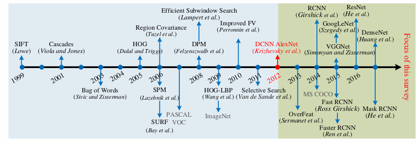

# Week 3

## What has been done this week

Last week didn't have any progress since my step mother passed away and I had to attend both the personal and practical implications of this. I've returned to work on the project this week, however I've had difficulties focusing, so complex tasks have been a bit unmanageable. Focused mostly on simpler stuff and just getting a basic detection model to work, setting up a new computer at trackman and looking into solutions like docker etc.

	

- [x] Script to convert annotation from beaverdam format to .xml Pascal VOC format

- [x] Frame extraction script:
  - [x] Script for simple frame extraction - extract all frames over 0.6 into the videos
  - [ ] More advanced extraction tool

- [x] Read detection overview

- [x] Setup new computer

  - [x] Install Linux
  - [x] Graphics Driver
  - [x] Tensorflow
  - [x] Typora
  - [x] openCV
  - [x] PyCharm

- [x] Look into docker

- [x] Calculate flow / stats for annotated videos to help remove false classifications

  The idea is, that the club is not able to move too much between frames thus if there is a large deviation from empirical mean, it could mean a false positive. Also if the club moves too much frame to frame, it will experience motion blur so the pictures will be bad anyways. Below is some figures showing the flow of the center coordinate of the club across frames for the annotated data. A difference threshold of about 16 pixels seem to remove the extreme outliers. 
  
  

- [x] Train first detection model
  **TRAIN TIME: 30 mins (the time that I had before I had to go home)**

  Unfortunately, the pictures got uploaded to the wrong folder and the computer is at work. However, 30 min training gave some good results in some frames, but sometimes the body of the shooter was also detected etc. Longer training time will help on some of these problems, and a more advanced model (which is slower), will also be able to improve performance.

  
  

  
  Used the first model (**ssd_mobilenet_v1_coco**)

### Difficulties / Questions

Trackman has been quite ensuring that enough data would be available at this point, but currently we still only have about 12-15 recorded sessions (with 5-15 videos in each). Any new data coming in will have to be annotated, I'm thinking that a basic detection model can help with this step but as of right now it doesn't look very promising. I'm worried that I will spend too much time of my project on data collection / annotation, tasks that has no real academic content and very not fun to do. Generally have a bad stomach feeling about the project right now, I fell that it will more or less just turn into retraining of 2 neural networks with a lot of time spend on data collection + annotation and data augmentation, this that take forever but is not really rewarding in terms of a master thesis project.

I've had to fight a bit with nvidia drivers and general Dev-Ops stuff as I always seem to do. Considering possibilities of docker etc to make the workflow easier and one-time-setup. Especially since the training will be cloud, inference locally etc. It's a pain in the ass to manage correct versions of tensorflow etc across multiple devices.

I'm considering how elaborate the theory section in the report needs to be. I'm guessing I will have to go into **SSD / mobileNet**, but would it be appropriate to assume that the reader has a basic understanding of feed forward neural networks and CNN's? 

## Status according to project plan

Since last week was "lost", I will still consider this week 3. Hopefully I will finish a week early compared to the project plan. I'm not completely done (in any way) with object detection, and it will most likely take me 2-3 days more. This will however include getting the training to run in the cloud, which is also a step for the later parts of the project. 

## Literature

**Liu et al: Deep Learning for Generic Object Detection: A survey**

A general overview of the different popular architectures used for object detection. 

Below: A quite good paragraph on the difficulties encountered in object detection problems.

* Sift, HOG etc (local descriptors) was popular in the late 1990s and 2000s
* 2012: AlexNet hits the stage
  
* SSD seems to be the way to go if we want to have real time (better than yolo from this paper)

##What to do next week

- [ ] BeaverDam: Make annotation guide
- [ ] Finish up object detection
- [ ] Get Azure cloud solution up and running (trackman has a deal with MS, will get a P100)
- [ ] look into pix2pix to generate night training sets: <https://github.com/phillipi/pix2pix>
- [ ] Write introduction to the report.
- [ ] Annotate important frames in video to feed into classification step